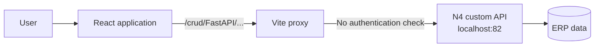
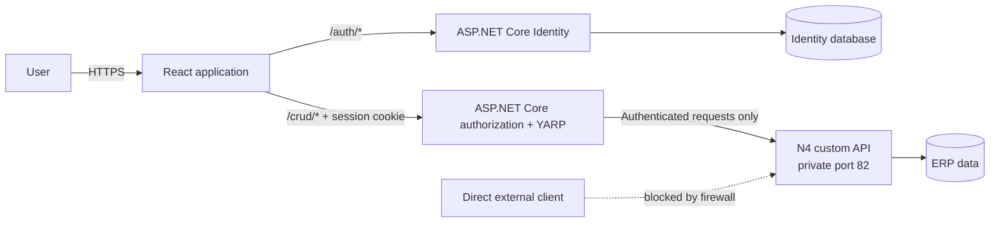
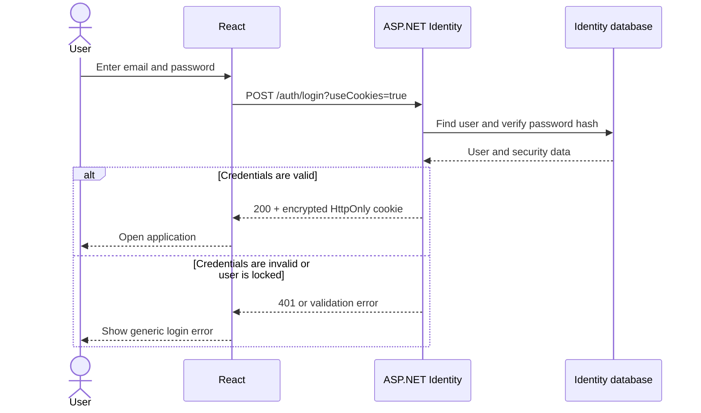
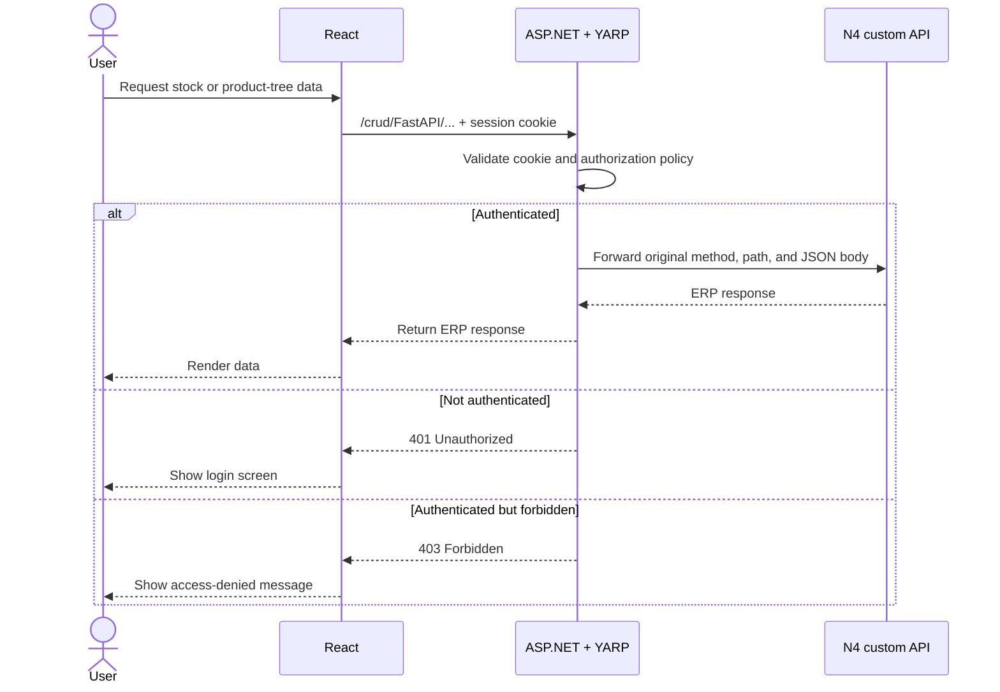
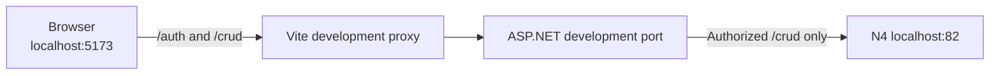
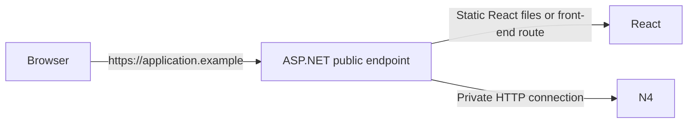

# Authentication Gateway Architecture Plan

## 1. Document purpose

This document describes the planned authentication and authorization layer for the Netsim React application while keeping all ERP CRUD operations in the existing N4 custom API.

It is structured so its architecture diagrams, request flows, implementation phases, security decisions, and test scenarios can be reused in an internship (`staj`) report.

## 2. Status and scope

- Status: architecture plan only
- Application changes: not implemented
- Authentication service: proposed ASP.NET Core Identity
- API gateway: proposed ASP.NET Core with YARP
- Business and CRUD logic: remains in the N4 custom API
- React responsibility: login interface, session-aware navigation, and API error handling

### In scope

- Local username/password authentication
- Encrypted cookie-based sessions
- Blocking unauthenticated N4 requests
- Forwarding authenticated `/crud` requests to N4
- Preventing clients from bypassing the gateway
- Roles or policies if different access levels are later required
- A report-ready testing and deployment plan

### Out of scope

- Moving N4 CRUD logic into ASP.NET
- Modifying the N4 API implementation
- Replacing the React application
- Building a custom password hashing or session system
- Public self-service registration unless it becomes a confirmed requirement

## 3. Current system

The current React request helper is located at `src/api/stokApi.js`.

```javascript
const API_ROOT = import.meta.env.VITE_API_ROOT ?? '/crud'
```

The functions in that file call paths such as:

```text
/crud/FastAPI/Stok/Kartlar
/crud/FastAPI/Stok/VaryantById
/crud/FastAPI/Stok/VaryantsOfVaryant
/crud/FastAPI/Stok/UrunAgaci
/crud/FastAPI/Stok/UrunAgaciV3
```

During development, `vite.config.js` currently forwards `/crud` directly to `http://localhost:82` without authentication.



**Figure 1 — Current request architecture:** React requests are forwarded to N4 without a server-side identity check.

## 4. Security problem

A login check implemented only in React is not a security boundary. A user can bypass the interface and send HTTP requests directly with browser developer tools, PowerShell, curl, Postman, or another client.

The server path must therefore enforce authentication before an N4 request is accepted. If N4 itself cannot validate authentication, an authenticated gateway must be the only publicly reachable path to N4.

## 5. Proposed architecture

ASP.NET Core will have two responsibilities:

1. Authenticate users with ASP.NET Core Identity.
2. Authorize and forward accepted `/crud` requests to N4 with YARP.

ASP.NET will not contain or duplicate the ERP CRUD operations.



**Figure 2 — Proposed architecture:** ASP.NET authenticates users and guards the N4 route, while N4 continues to execute the business operations.

### Component responsibilities

| Component | Responsibility | Must not do |
|---|---|---|
| React | Display login, call `/auth` and `/crud`, react to `401` and `403` | Decide whether a request is truly authorized |
| ASP.NET Core Identity | Store users, hash passwords, issue sessions, support lockout and password management | Implement N4 business operations |
| ASP.NET authorization | Require an authenticated user and optionally enforce roles/policies | Trust authorization values supplied by React |
| YARP | Forward accepted HTTP requests and return N4 responses | Expose N4 without an authorization policy |
| N4 custom API | Execute existing ERP queries and CRUD operations | Be directly reachable by public clients |
| Identity database | Store Identity users, password hashes, roles, claims, and tokens | Store plaintext passwords |

## 6. Login sequence

The recommended browser session uses an encrypted, `HttpOnly`, `Secure` cookie. The password is sent only to ASP.NET over HTTPS and is never sent to N4.



**Figure 3 — Login sequence:** Identity verifies the user and the browser receives an encrypted session cookie.

### Conceptual React login request

```javascript
const response = await fetch('/auth/login?useCookies=true', {
  method: 'POST',
  headers: { 'Content-Type': 'application/json' },
  body: JSON.stringify({ email, password }),
})

if (!response.ok) {
  throw new Error('Invalid email or password')
}
```

When React and ASP.NET share the same origin, the browser stores and sends the cookie automatically. The application must not copy the authentication cookie into JavaScript storage.

## 7. Authenticated N4 request sequence

The existing `/crud` URL can remain the public API root. Its destination changes from a direct N4 proxy to the authenticated ASP.NET gateway.



**Figure 4 — Protected CRUD sequence:** N4 receives the request only after ASP.NET validates the session.

## 8. Conceptual ASP.NET configuration

The final code will depend on the selected .NET version, database provider, hosting model, and user provisioning rules. The central structure is expected to be:

```csharp
builder.Services.AddDbContext<ApplicationDbContext>(options =>
    options.UseSqlServer(
        builder.Configuration.GetConnectionString("IdentityDatabase")));

builder.Services
    .AddIdentityApiEndpoints<IdentityUser>()
    .AddEntityFrameworkStores<ApplicationDbContext>();

builder.Services.AddAuthorization();

builder.Services.AddReverseProxy()
    .LoadFromConfig(builder.Configuration.GetSection("ReverseProxy"));

var app = builder.Build();

app.UseAuthentication();
app.UseAuthorization();

app.MapGroup("/auth").MapIdentityApi<IdentityUser>();
app.MapReverseProxy();

app.Run();
```

### Conceptual YARP route

The current Vite proxy preserves the complete `/crud` path, so the initial YARP design also preserves it.

```json
{
  "ReverseProxy": {
    "Routes": {
      "n4": {
        "ClusterId": "n4",
        "AuthorizationPolicy": "default",
        "Match": {
          "Path": "/crud/{**remaining}"
        },
        "Transforms": [
          {
            "RequestHeaderRemove": "Cookie"
          }
        ]
      }
    },
    "Clusters": {
      "n4": {
        "Destinations": {
          "primary": {
            "Address": "http://127.0.0.1:82/"
          }
        }
      }
    }
  }
}
```

`AuthorizationPolicy: default` requires an authenticated user. Removing the `Cookie` request header prevents the ASP.NET session cookie from being passed to N4 after authorization succeeds.

## 9. Authentication endpoints

ASP.NET Core Identity API endpoints can provide the following capabilities:

| Endpoint | Purpose | Proposed exposure |
|---|---|---|
| `POST /auth/login?useCookies=true` | Start a cookie-authenticated session | Public |
| `GET /auth/manage/info` | Return information about the signed-in user | Authenticated |
| Logout endpoint | End the current session | Authenticated |
| Password reset endpoints | Reset a forgotten password | Optional |
| Email confirmation endpoints | Confirm ownership of an email address | Optional |
| Registration endpoint | Create an account | Disabled for an employee-only system unless approved |
| 2FA management endpoints | Configure two-factor authentication | Optional future hardening |

For an internal application, administrators should provision accounts. Public registration would unnecessarily expand the attack surface.

## 10. Development and production routing

### Development



The future Vite configuration should proxy both `/auth` and `/crud` to ASP.NET. It should no longer proxy `/crud` directly to N4.

### Production



React and the authentication gateway should preferably share one public origin. This avoids unnecessary cross-origin cookie and CORS configuration.

## 11. Network security boundary

Authentication at the gateway is effective only if clients cannot bypass it.

Required controls:

- Bind N4 to `127.0.0.1` when ASP.NET and N4 run on the same machine.
- If they run on different machines, allow the N4 port only from the ASP.NET server address.
- Do not publish N4 port `82` to the internet or general client network.
- Expose the ASP.NET endpoint through HTTPS.
- Keep the Identity database connection string outside source control.
- Protect ASP.NET Data Protection keys and persist them when multiple application instances are used.

## 12. Authorization model

The smallest initial policy is: every authenticated user may access all existing `/crud` routes.

If business requirements later distinguish access levels, ASP.NET policies can be added without changing N4 CRUD code. Possible roles include:

| Role | Example permission |
|---|---|
| `Viewer` | Read stock, variants, and product trees |
| `Editor` | Perform approved create or update operations |
| `Administrator` | Manage accounts and role assignments |

Roles should only be introduced when the corresponding business rules are confirmed.

## 13. Security requirements

### Password and account security

- Let ASP.NET Core Identity hash and verify passwords.
- Never store or log plaintext passwords.
- Require an appropriate password policy.
- Enable account lockout or throttling for repeated failures.
- Return a generic invalid-login response that does not reveal whether an account exists.
- Provide password reset only if its email or administrator workflow is defined.

### Cookie security

- `HttpOnly`: prevents JavaScript from reading the session cookie.
- `Secure`: sends the cookie only over HTTPS.
- `SameSite`: use the strictest value compatible with the selected login flow.
- Short, defined expiration with appropriate renewal behavior.
- Server-side invalidation when a user is disabled or security data changes.

### CSRF protection

Cookie-authenticated state-changing requests must be protected against Cross-Site Request Forgery. Before write operations are exposed, the gateway should issue an antiforgery token and validate it for unsafe methods such as `POST`, `PUT`, `PATCH`, and `DELETE` as appropriate.

The existing N4 interface also uses some `POST` requests for data retrieval. Their exact CSRF treatment should be verified during implementation rather than inferred only from the HTTP verb.

### Forwarded headers

- Strip the ASP.NET authentication cookie before forwarding to N4.
- Do not trust role, username, or user-ID headers received from the browser.
- If N4 later needs an audit identity, ASP.NET must remove any client-provided identity header and create a new trusted header after authentication.

## 14. React behavior

The React application will need only session-related behavior; its N4 data functions can continue using `/crud`.

Expected behavior:

| Response | React action |
|---|---|
| `200` | Process the N4 response normally |
| `400` | Display a safe validation message |
| `401` | Clear local user state and show the login page |
| `403` | Display an access-denied state |
| `502` or `503` | Report that the upstream ERP service is unavailable |
| Other `5xx` | Display a generic server error and retain diagnostic correlation information |

React may hide protected screens when no session is present, but this is a usability feature only. ASP.NET remains the security enforcement point.

## 15. Implementation phases

### Phase 1 — Create the authentication gateway

- Create an ASP.NET Core project.
- Add ASP.NET Core Identity with the selected database provider.
- Add YARP.
- Configure authentication and authorization middleware in the correct order.
- Configure `/crud/{**remaining}` as an authenticated proxy route.

**Acceptance:** an unauthenticated `/crud` request returns `401`; an authenticated request reaches N4.

### Phase 2 — Establish user management

- Create the Identity database schema through reviewed migrations.
- Define how the first administrator is created.
- Decide whether accounts are administrator-provisioned or self-registered.
- Configure password, lockout, cookie, and session rules.

**Acceptance:** a valid account can log in and log out; invalid credentials do not create a session.

### Phase 3 — Connect React

- Add the login screen and session initialization.
- Proxy `/auth` and `/crud` to ASP.NET during development.
- Handle `401` and `403` centrally.
- Keep `API_ROOT` as `/crud` unless deployment requirements prove otherwise.

**Acceptance:** refreshing the application preserves a valid session, and an expired session returns the user to login.

### Phase 4 — Lock down N4

- Bind N4 to a private interface or add firewall restrictions.
- Confirm that direct client access to port `82` fails.
- Confirm that ASP.NET can still reach N4.

**Acceptance:** the same request fails when sent directly to N4 but succeeds through the authenticated gateway.

### Phase 5 — Add production safeguards

- Enable HTTPS and secure cookies.
- Add CSRF protection for state-changing operations.
- Configure protected Data Protection key storage.
- Add safe structured logging and correlation IDs.
- Add rate limiting to login endpoints if needed.
- Define backup and recovery for the Identity database.

**Acceptance:** the security test matrix passes in a production-like environment.

## 16. Test matrix

| Scenario | Expected result |
|---|---|
| Correct email and password | Login succeeds and an encrypted cookie is issued |
| Incorrect password | Login fails without revealing whether the email exists |
| Missing session cookie on `/crud` | `401 Unauthorized`; N4 is not called |
| Valid session cookie on `/crud` | Request is forwarded and the N4 response is returned |
| Disabled or locked user | Login or renewed session is rejected according to policy |
| Authenticated user without a required role | `403 Forbidden`; N4 is not called |
| Direct request to N4 port from a client machine | Connection is blocked |
| Expired session | `/crud` returns `401`; React shows login |
| Logout followed by `/crud` request | Request returns `401` |
| Forged username or role header | Header is ignored or replaced by the gateway |
| Cross-site write attempt | Rejected by CSRF protection |
| N4 unavailable | Gateway returns an appropriate upstream failure response |

## 17. Logging and report evidence

Useful evidence for implementation verification:

- ASP.NET log showing a rejected unauthenticated `/crud` request without sensitive data.
- ASP.NET/YARP log showing an accepted route and N4 response status.
- Network test showing that port `82` is unreachable externally.
- Browser network capture showing `401`, successful login, then successful `/crud` access.
- Identity database diagram showing authentication data separated from ERP business data.
- Test results summarized from the matrix above.

Logs and screenshots used in the report must redact cookies, passwords, reset tokens, database connection strings, and personal information.

## 18. Suggested internship report structure

1. **Problem definition** — the original N4 API had no authentication layer.
2. **Current architecture analysis** — React and the Vite proxy called N4 directly.
3. **Security requirement** — client-side login checks can be bypassed.
4. **Technology selection** — ASP.NET Core Identity for accounts and YARP for authenticated forwarding.
5. **Proposed architecture** — reuse Figure 2.
6. **Login design** — reuse Figure 3.
7. **Protected API flow** — reuse Figure 4.
8. **Implementation stages** — summarize Section 15.
9. **Security controls** — summarize Sections 11 and 13.
10. **Verification** — present the test matrix and selected screenshots.
11. **Result** — authentication was added without rewriting the existing ERP API.

### Short report-ready summary

> The existing React application communicated with the N4 custom API through an unauthenticated proxy. Because checks implemented only in the browser can be bypassed, an ASP.NET Core gateway was designed as the server-side security boundary. ASP.NET Core Identity manages user accounts and encrypted sessions, while YARP validates authorization policies and forwards accepted requests to N4. The N4 service continues to execute the existing ERP operations and is restricted to private network access, preventing direct unauthenticated calls.

## 19. Decisions still required before implementation

- Supported .NET version and hosting environment
- Identity database provider and server location
- Employee account provisioning process
- Whether email confirmation, password reset, and 2FA are required
- Initial session duration and lockout policy
- Whether any N4 route needs a role beyond “authenticated user”
- Whether ASP.NET and N4 will run on the same host
- Production domain, TLS certificate, and reverse-proxy arrangement
- Audit logging and personal-data retention requirements

These decisions affect configuration, but they do not change the central architecture.

## 20. References

- [Use Identity to secure a Web API backend for SPAs](https://learn.microsoft.com/en-us/aspnet/core/security/authentication/identity-api-authorization?view=aspnetcore-10.0)
- [Use cookie authentication without ASP.NET Core Identity](https://learn.microsoft.com/en-us/aspnet/core/security/authentication/cookie?view=aspnetcore-10.0)
- [YARP authentication and authorization](https://learn.microsoft.com/en-us/aspnet/core/fundamentals/servers/yarp/authn-authz?view=aspnetcore-10.0)
- [YARP configuration files](https://learn.microsoft.com/en-us/aspnet/core/fundamentals/servers/yarp/config-files?view=aspnetcore-10.0)
- [YARP request transforms](https://learn.microsoft.com/en-us/aspnet/core/fundamentals/servers/yarp/transforms-request?view=aspnetcore-10.0)
- [Prevent Cross-Site Request Forgery attacks in ASP.NET Core](https://learn.microsoft.com/en-us/aspnet/core/security/anti-request-forgery?view=aspnetcore-10.0)

References last reviewed: 4 August 2026.
